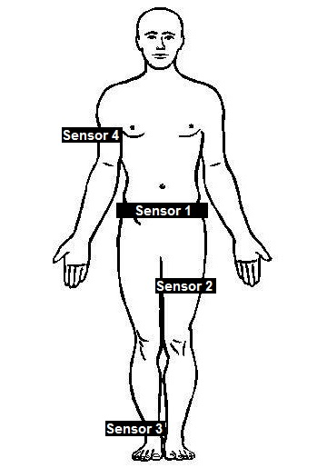

This machine learning project uses the a dataset of a research on Human Activity Recognition (HAR): [Wearable Computing: Classification of Body Postures and Movements (PUC-Rio) Data Set](http://archive.ics.uci.edu/ml/datasets/Wearable+Computing%3A+Classification+of+Body+Postures+and+Movements+%28PUC-Rio%29). 

The dataset contains 5 activity classes (sitting-down, standing-up, standing, walking, and sitting), collected from 4 healthy subjects wearing accelerometers during 8 hours of activities. The sensors were mounted on their waist, left thigh, right arm, and right ankle. The classification uses 12 (x, y, z coordinates of 4 accelerometers) input attributes derived from a time window of 150ms. 

The original research used AdaBoost that combines ten Decision Trees. Their observed classifier accuracy was 99.4%. This project compares the accuracy of 4 models (Distributed Random Forest, Gradient Boosting Method, Neural Networks, and Deep Learning). The model parameters are evaluated via grid search.
